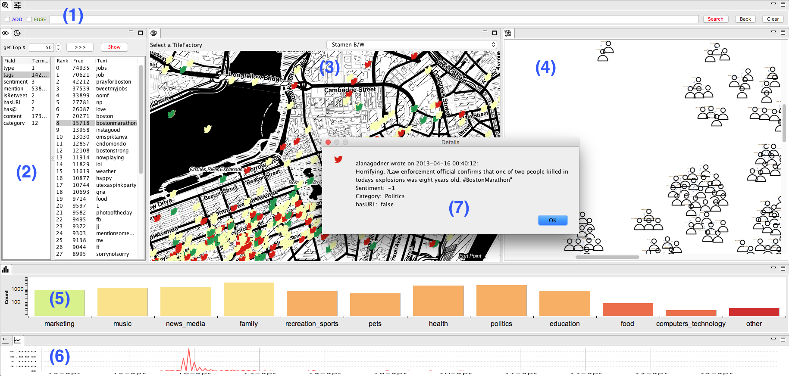

# SocialOcean
SocialOcean enables users to explore geo-tagged social media data.
In the context of my Master Thesis, it is tailored to Echo Chamber detection.
Depending on the pre-processed features, it can be adapted for other purposes.
The tool utilizes a Lucene index and a corresponding PostgreSQL database.
A script to create the Lucene index is included.
This repository is an Eclipse RCP project. So it enables plugin-creation.

The initial idea and a prototype was presented at the EuroVis2017.
A demonstration video, a poster and a short paper can be downloaded at: [http://socialocean.dbvis.de/eurovis2017/](http://socialocean.dbvis.de/eurovis2017/)  
The result of the Master Thesis is captured in a video as well: 
[http://socialocean.dbvis.de/SocialOcean/](http://socialocean.dbvis.de/SocialOcean/)

## Setup

- You will need a **Eclipse RCP** Version to run this project as an eclipse application:  
[http://www.eclipse.org/downloads/packages/eclipse-rcp-and-rap-developers/neon3](http://www.eclipse.org/downloads/packages/eclipse-rcp-and-rap-developers/neon3)  
One of the best **tutorials** to eclipse RCP are by Lars Vogella. They can be found [**here**](http://www.vogella.com/tutorials/EclipseRCP/article.html)
or from eclipse itself, see [**here**](http://wiki.eclipse.org/Eclipse4/RCP).

- For a local version you need a PostgreSQL database:  
	Download [Postgres](https://www.postgresql.org) and install the [Postgis](http://postgis.net) extension.

- **Clone** this git reporsitory and import the project into Eclipse.

- create a **db_config.properties** file (according to the template) within the settings folder that fits to your database credentials.

### Possible Problems
Depending on the system that you use, you may have to adapt the configuration of the **target platform**.
But first try to change the settings at:

	SocialOcean.product --> Configuration --> Configuration File (maxosx, solaris, win32)
	SocialOcean.product --> Contents --> Add Required Plug-ins

## Pre-Processing

There are three scripts, that offer some basic pre-processing.

	src/scripts:
		(1) AddCategoryScript.java
		(2) AddSentimentScript.java
		(3) Geocoding.java
		(4) IndexTweets.java

The first two (1) und (2) scripts need the following database fields:

	tweet_id, long
	tweet_content,  String

The indexing scripts (4) in the current form needs the following database fields from the **tweets** table:

-	_tweet_id_, 			**long**
-	_tweet_creationdate_,		**String**, timestamp of the form "yyyy-dd-MM hh:mm:ss", example: "2013-08-01 01:15:00"
-	_tweet_content_,			**String**
-	_relationship_,			**String** (Tweet, Followed)
-	_latitude_,			**double**
-	_longitude_, 			**double**
-	_hasurl_, 			**boolean**
- _user___screenname_, 	**String** 
-	_source_, 			**String**
- _user___language_, **String**
-	_positive_, 			**int** (result of SentiStrength.jar)
-	_negative_, 			**int** (result of SentiStrength.jar)
-	_category_, 			**String** (1)
-	_sentiment_, 			**String** (2)

And the following fields from the **users** table:

- _gender_, **String** (default: unknown)
- _user___statusescount_, **int**
- _user___followerscount_, **int**
- _user___friendscount_, **int**
- _user___listedcount_, **int**
- _desc___score_, **double** ( [0,1] value that rates the text of the user description )
- _latitude_, **double** (3)\* 
- _longitude_, **double** (3)\*  

\*import **reference data**: [_cities1000_](http://download.geonames.org/export/dump/) from geonames and [_timezone\_shapes_](https://github.com/evansiroky/timezone-boundary-builder/releases):  

## Useful Tools

- If it is not yet included and you would like to have a GUI tool for the database, you could download [DataGrip](https://www.jetbrains.com/datagrip/download/) or [PgAdmin](https://www.pgadmin.org)

## Further Reading

[http://wiki.eclipse.org/Eclipse4/RCP](http://wiki.eclipse.org/Eclipse4/RCP)

[http://www.vogella.com/tutorials/EclipseRCP/article.html](http://www.vogella.com/tutorials/EclipseRCP/article.html)
